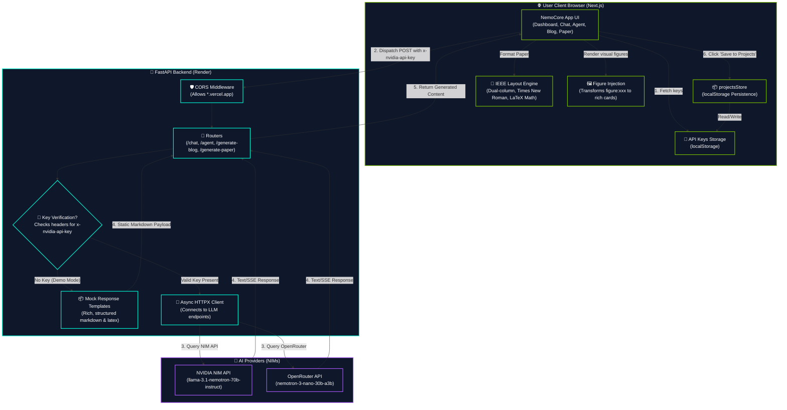
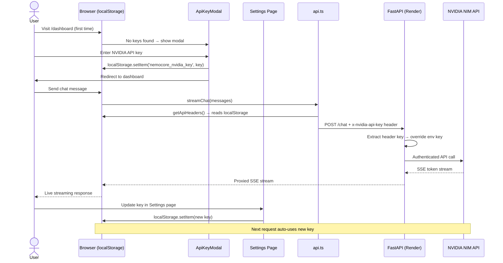
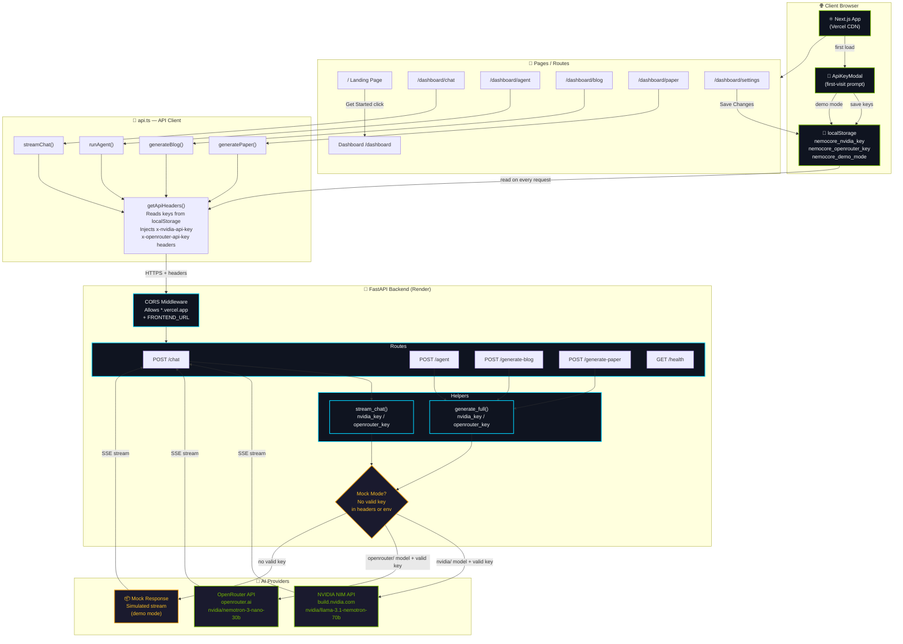
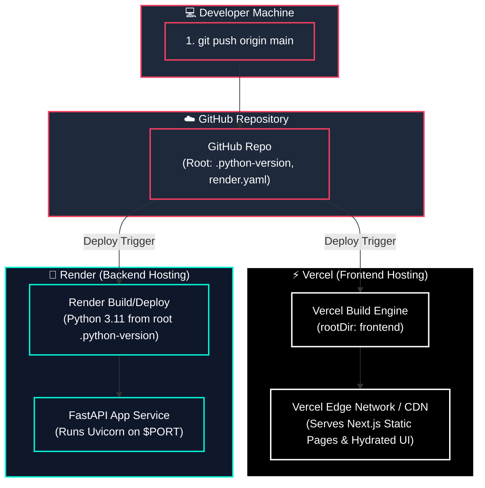

# NemoCore AI – Agentic AI Platform powered by NVIDIA Nemotron 3

A production-grade AI SaaS platform built for the NVIDIA Nemotron 3 Workshop. NemoCore AI showcases how to construct agentic systems, document generators, research assistants, and live telemetry platforms utilizing high-performance NVIDIA NIMs.

> [!TIP]
> 🚀 **Live Demo:** **[https://nemotron-3.vercel.app](https://nemotron-3.vercel.app)**

[](https://nemotron-3.vercel.app)


---

## 📽️ Visual Demo

<div align="center">
  <h3>📽️ Full Platform Walkthrough</h3>
  <video src="./1.mp4" width="100%" controls muted autoplay loop>
    Your browser does not support the video tag. <a href="./1.mp4">Watch the video here</a>.
  </video>
  <p><i>If the video doesn't load, <a href="./1.mp4">click here to watch it directly.</a></i></p>
  <br/>
  
  <br/><br/>
  
  
</div>

---

## ⚡ Request & Content Generation Dataflow

This diagram represents the step-by-step dataflow of generating content (Blog, Research Paper, Agent Plan, Chat) and persisting it locally without database requirements.



---

## 🔑 API Key Flow (No Login Required)



---

## 🏗️ System Architecture



---

## 🔄 Deployment Architecture

This diagram illustrates how changes pushed to GitHub trigger independent builds on Vercel (frontend) and Render (backend).



---

## 🚀 Key Features Breakdown

- 🏠 **Premium Hub Landing Page**: Complete landing page experience featuring an interactive pricing matrix, live showcase, testimonials, and glassmorphic card grids.
- 🔑 **Decentralized API Key Architecture**: Safe design architecture where user keys (`nvapi-...` or `sk-or-...`) are managed completely on the client-side (`localStorage`). The FastAPI backend proxies requests without retaining logs of keys, guaranteeing full confidentiality.
- 💬 **Advanced AI Chat Room**: Implements real-time Server-Sent Events (SSE) streaming, deep markdown syntax parsing (via `react-markdown`), LaTeX formula compilation, and custom syntax themes for code block rendering.
- 🤖 **Agent Studio**: Generates dynamic execution flows decomposing heavy user prompts into a 4-step interactive pipeline. Displays stateful completion badges and live outputs.
- 📄 **IEEE Layout Academic Engine**: Adapts structural LaTeX, multi-column simulation grids, Times New Roman standard styling, and custom figure integrations (`figure:architecture`, `figure:chart`) into clean academic formats.
- 📝 **SEO Content Blog Suite**: Interactive generator accepting topic, length, and tone inputs. Automatically inserts image hooks (`figure:blog-banner` and `figure:blog-chart`) that the UI displays as high-fidelity visual cards.
- 📊 **Telemetry & Analytics**: Uses Recharts to visualize real-time simulated platform query throughput, latency, token ingestion rates, and LLM distribution metrics.

---

## 🛠️ API Reference (FastAPI Backend)

All endpoints accept client-passed override API keys in request headers. If no keys are specified, the API gracefully defaults to its server env keys. If those are absent, it routes to **Demo Mode (Mock Response Generation)**.

### Custom Headers

| Header | Description |
|---|---|
| `x-nvidia-api-key` | Client's custom NVIDIA NIM API Key |
| `x-openrouter-api-key` | Client's custom OpenRouter API Key |

### Endpoints

#### 1. Chat Stream
* **URL:** `/chat`
* **Method:** `POST`
* **Payload:**
```json
{
  "messages": [
    {"role": "user", "content": "Explain Mamba vs Transformers"}
  ],
  "model": "nvidia/llama-3.1-nemotron-70b-instruct",
  "temperature": 0.7,
  "max_tokens": 1024
}
```
* **Response:** Server-Sent Events (SSE) stream (`text/event-stream`).

#### 2. Agent Workflow Planner
* **URL:** `/agent`
* **Method:** `POST`
* **Payload:**
```json
{
  "task": "Create a secure user login system in Node.js",
  "model": "nvidia/llama-3.1-nemotron-70b-instruct"
}
```
* **Response:**
```json
{
  "task": "Create a secure user login system in Node.js",
  "mock": false,
  "steps": [
    {
      "step": 1,
      "title": "Establish DB Connection & Schema",
      "description": "Initialize postgres db and layout user credentials table with schema validation.",
      "output": "Database schema finalized."
    }
    // ... total 4 steps
  ]
}
```

#### 3. Blog Post Suite
* **URL:** `/generate-blog`
* **Method:** `POST`
* **Payload:**
```json
{
  "topic": "The Future of Edge AI Computing",
  "tone": "professional",
  "length": "medium"
}
```
* **Response:**
```json
{
  "title": "The Future of Edge AI Computing",
  "content": "... Markdown with embedded figure tags ...",
  "word_count": 850,
  "topic": "The Future of Edge AI Computing",
  "mock": false
}
```

#### 4. IEEE Research Assistant
* **URL:** `/generate-paper`
* **Method:** `POST`
* **Payload:**
```json
{
  "title": "Latent Mixture-of-Experts with Multi-Token Predictors",
  "domain": "Computer Science",
  "keywords": ["Transformers", "MoE", "NVIDIA NIM"]
}
```
* **Response:**
```json
{
  "title": "Latent Mixture-of-Experts with Multi-Token Predictors",
  "content": "... Full IEEE Academic styled text with sections (I, II, III etc.) ...",
  "domain": "Computer Science",
  "mock": false
}
```

---

## 📁 Detailed Folder Structure

```
Nemotron_3/
├── frontend/                   # Next.js 16 App (→ Vercel)
│   ├── src/
│   │   ├── app/
│   │   │   ├── page.tsx        # Responsive Landing Hub
│   │   │   ├── (auth)/         # Shell auth pathways (redirects to dashboard)
│   │   │   └── (dashboard)/    # Dashboard layout enclosing:
│   │   │       ├── page.tsx    # Telemetry metrics + welcome card
│   │   │       ├── chat/       # Chat view with SSE streamer
│   │   │       ├── agent/      # Agent Studio layout
│   │   │       ├── blog/       # SEO Blog Post compiler
│   │   │       ├── paper/      # LaTeX and IEEE formatting grid
│   │   │       ├── projects/   # localStorage project cache browser
│   │   │       ├── analytics/  # Recharts usage dashboard
│   │   │       └── settings/   # localStorage API credentials settings
│   │   ├── components/
│   │   │   ├── ApiKeyModal.tsx # First-visit modal overlay
│   │   │   ├── Sidebar.tsx     # Collapsible navigation drawer
│   │   │   └── MarkdownRenderer.tsx # Contextual figure inject & parser
│   │   └── lib/
│   │       ├── api.ts          # API Client + custom headers payload
│   │       └── utils.ts        # Style and tailwind mixers
│   ├── .env.production         # Next production target endpoints
│   └── vercel.json             # Vercel deployment directives
│
├── backend/                    # FastAPI App (→ Render)
│   ├── main.py                 # Router logic, stream yielders & fallback mocks
│   ├── requirements.txt        # Backend dependencies
│   ├── render.yaml             # Render infrastructure blueprint
│   └── .env                    # Local environmental overrides (ignored by Git)
│
└── README.md                   # System Documentation
```

---

## ⚡ Quick Start (Local Setup)

### Prerequisites
* **Node.js**: v18 or newer (v20+ recommended)
* **Python**: v3.11.x

### 1. Configure the Backend

```bash
# Navigate to backend directory
cd backend

# Create virtual environment
python -m venv venv

# Activate virtual environment
# Windows:
.\venv\Scripts\activate
# macOS/Linux:
source venv/bin/activate

# Install dependencies
pip install -r requirements.txt

# Create local environment config
cp .env.example .env
```

Edit the `.env` file to supply credentials if you have them:
```env
NVIDIA_API_KEY=nvapi-your-key-here
OPENROUTER_API_KEY=sk-or-your-key-here
FRONTEND_URL=http://localhost:3000
```

### 2. Configure the Frontend

```bash
# Navigate to frontend directory
cd ../frontend

# Install node dependencies
npm install
```

### 3. Spin Up Development Servers

Run the backend API service (Terminal 1):
```bash
cd backend
# Make sure your virtual environment is active!
uvicorn main:app --reload --port 8000
```

Run the Next.js dev server (Terminal 2):
```bash
cd frontend
npm run dev -- --port 3001
```

Access the UI at **[http://localhost:3001](http://localhost:3001)**. 

* **No Credentials?** Select **"Use Demo Mode"** in the initial setup prompt to experience the platform features using simulated streams.

---

## 🔑 Fetching NIM / API Credentials

### NVIDIA Nemotron NIMs
1. Register on the [NVIDIA Build Portal](https://build.nvidia.com).
2. Browse to any supported model (e.g. `llama-3.1-nemotron-70b-instruct`).
3. Click **Get API Key** and generate an token starting with `nvapi-`.

### OpenRouter (Alternative Gateway)
1. Join [OpenRouter.ai](https://openrouter.ai).
2. Go to keys settings and create a new key (`sk-or-`).
3. Deposit minimal balance for paid models, or use free tier models (e.g. `nvidia/nemotron-3-nano-30b-a3b`).

---

## 🚀 Deployment Instructions

### Frontend → Vercel Deployment

1. Initialize a Git repository and push your project to GitHub.
2. Link the repository to your [Vercel account](https://vercel.com).
3. Set the **Root Directory** field to `frontend`.
4. Configure the Production Environment Variables:
   * `NEXT_PUBLIC_API_URL`: `https://your-backend-api.onrender.com` (Your Render deployment URL)
5. Hit **Deploy**.

### Backend → Render Deployment

1. Register on [Render](https://render.com).
2. Connect your GitHub repository and select **New Web Service**.
3. Set the **Root Directory** to `backend`.
4. Fill configuration details:
   * **Runtime**: `Python`
   * **Build Command**: `pip install -r requirements.txt`
   * **Start Command**: `uvicorn main:app --host 0.0.0.0 --port $PORT`
5. Click **Advanced** and fill the Environment Variables:
   * `NVIDIA_API_KEY`: `nvapi-xxx`
   * `OPENROUTER_API_KEY`: `sk-or-xxx`
   * `FRONTEND_URL`: `https://your-frontend-deployment.vercel.app`
6. Click **Deploy Web Service**.

---

## 🧠 Technological Blueprint

| Category | Tools & Libraries |
|---|---|
| **Core Layout** | Next.js 16 (App Router), TypeScript, Tailwind CSS |
| **Motion Physics** | Framer Motion (Transitions, orchestrations) |
| **Microservices** | FastAPI, Python 3.11, httpx client |
| **Integrations** | NVIDIA NIM API Gateway, OpenRouter Router |
| **UI Telemetry** | Recharts (Responsive Line, Bar and Pie configurations) |
| **Renderers** | react-markdown, react-syntax-highlighter (Prism themes) |
| **Local Cache** | Browser localStorage (JSON-serialized local state store) |

---

Built for the **NVIDIA Nemotron 3 Workshop 2026** 🟩

