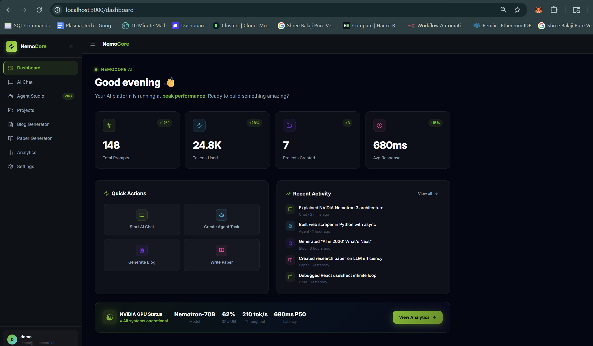
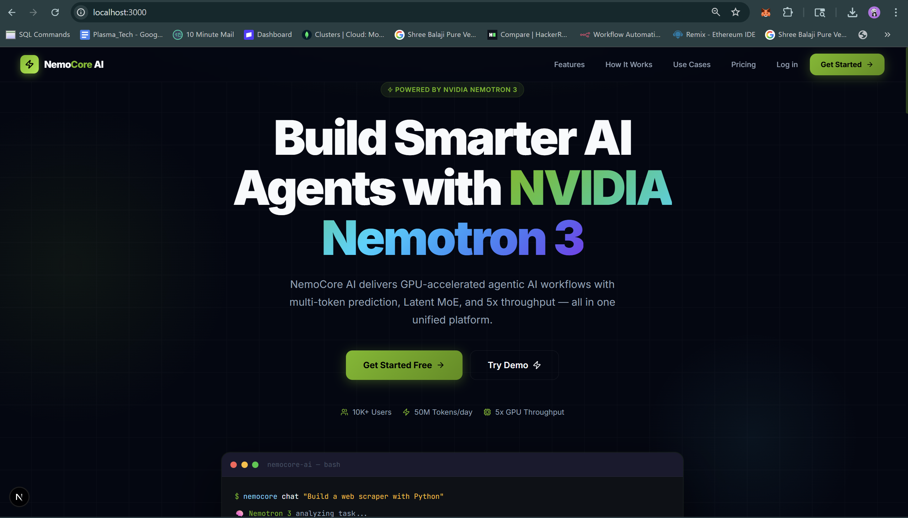
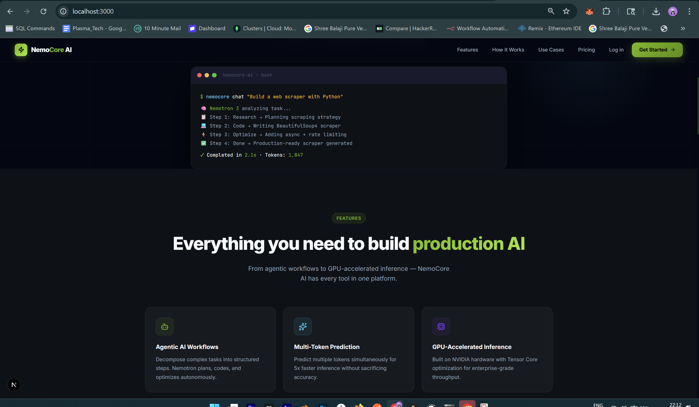
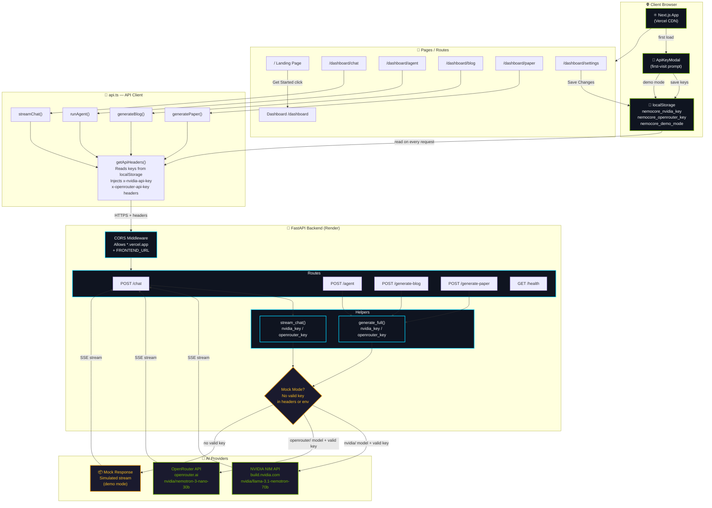
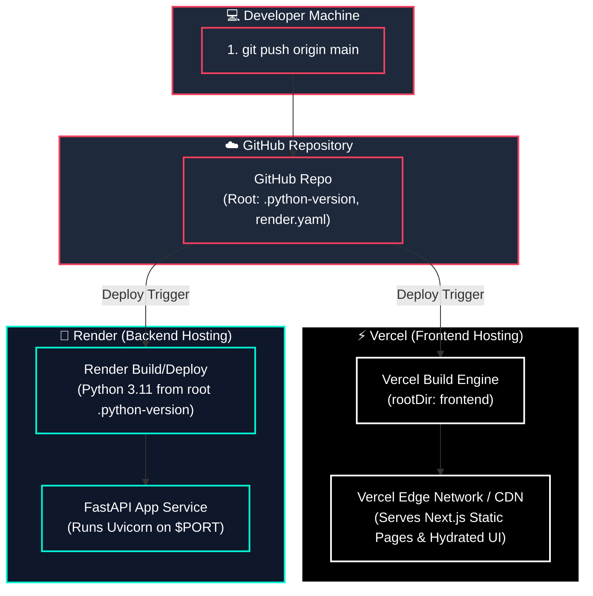
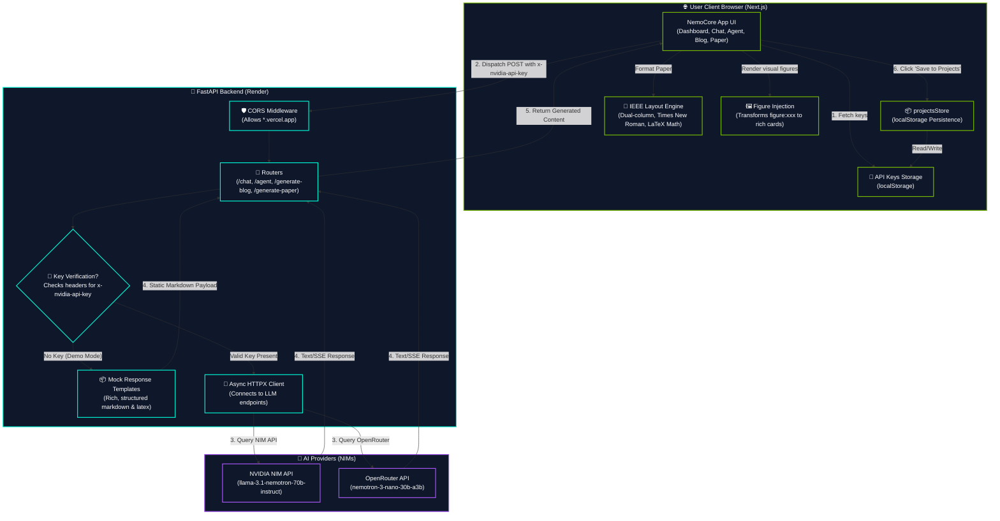
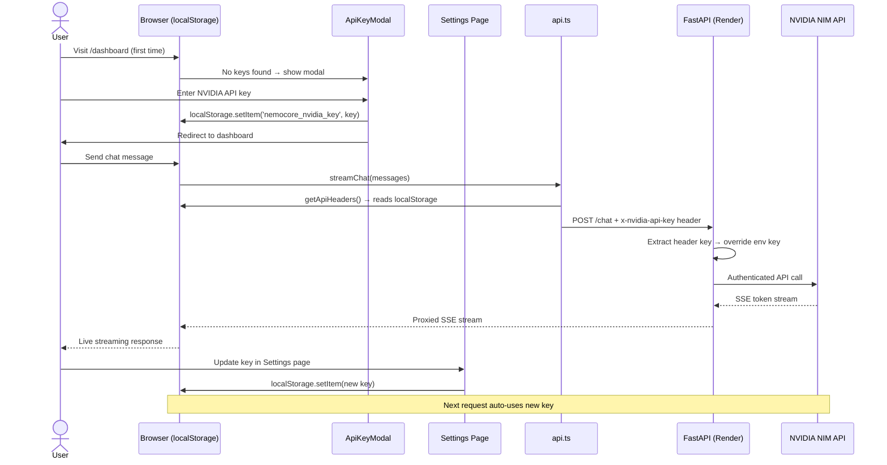

# NemoCore AI – Agentic AI Platform powered by NVIDIA Nemotron 3

A production-grade AI SaaS platform built for the NVIDIA Nemotron 3 Workshop.


---

## 📽️ Visual Demo

<div align="center">
  <h3>📽️ Full Platform Walkthrough</h3>
  <video src="./1.mp4" width="100%" controls muted autoplay loop>
    Your browser does not support the video tag. <a href="./1.mp4">Watch the video here</a>.
  </video>
  <p><i>If the video doesn't load, <a href="./1.mp4">click here to watch it directly.</a></i></p>
  <br/>
  
  <br/><br/>
  
  
</div>

---

## 🏗️ System Architecture



---

## 🔄 Deployment Architecture

This diagram illustrates how changes pushed to GitHub trigger independent builds on Vercel (frontend) and Render (backend).



---

## ⚡ Request & Content Generation Dataflow

This diagram represents the step-by-step dataflow of generating content (Blog, Research Paper, Agent Plan, Chat) and persisting it locally without database requirements.



---

## 🔑 API Key Flow (No Login Required)



---

## 🚀 Features

| Feature | Description |
|---|---|
| 🏠 **Landing Page** | Premium hero, features, pricing, testimonials |
| 🔑 **No-Login API Key Setup** | Keys stored in localStorage, injected per-request |
| 💎 **API Key Modal** | Glassmorphic first-visit modal with live validation |
| 📊 **Dashboard** | Stats, quick actions, GPU metrics |
| 💬 **AI Chat** | Streaming, markdown, voice input, model selector |
| 🤖 **Agent Studio** | Agentic task decomposition with step timeline |
| 📂 **Projects** | Save, search, filter, download projects |
| 📝 **Blog Generator** | Topic → full SEO blog with tone/length control |
| 📄 **Paper Generator** | Academic papers with citations |
| 📊 **Analytics** | Recharts: queries, tokens, latency, model usage |
| ⚙️ **Settings** | Profile, API key (synced to localStorage), theme |

---

## 📁 Folder Structure

```
Nemotron_3/
├── frontend/                   # Next.js 16 App (→ Vercel)
│   ├── src/
│   │   ├── app/
│   │   │   ├── page.tsx        # Landing page
│   │   │   ├── (auth)/         # Login, Signup (redirect → /dashboard)
│   │   │   └── (dashboard)/    # All dashboard pages
│   │   ├── components/
│   │   │   ├── ApiKeyModal.tsx  # First-visit API key prompt
│   │   │   ├── DashboardShell.tsx
│   │   │   ├── Sidebar.tsx
│   │   │   └── MarkdownRenderer.tsx
│   │   └── lib/
│   │       ├── api.ts          # All fetch calls + localStorage key injection
│   │       └── utils.ts
│   ├── .env.production         # NEXT_PUBLIC_API_URL (committed, no secrets)
│   └── vercel.json             # Vercel deployment config
│
├── backend/                    # FastAPI (→ Render)
│   ├── main.py                 # Routes + NVIDIA/OpenRouter integration
│   ├── requirements.txt
│   ├── render.yaml             # Render deployment config
│   └── .env                   # Local secrets (never committed)
│
└── README.md
```

---

## ⚡ Quick Start (Local)

### 1. Clone & Install

```bash
# Frontend
cd frontend
npm install

# Backend
cd backend
python -m venv venv
.\venv\Scripts\activate        # Windows
pip install -r requirements.txt
cp .env.example .env
```

### 2. Run Servers

```bash
# Terminal 1 – Backend
cd backend && .\venv\Scripts\activate
uvicorn main:app --reload --port 8000

# Terminal 2 – Frontend
cd frontend
npm run dev -- --port 3001
```

Open **[http://localhost:3001](http://localhost:3001)** → the API key modal appears on first visit.

> **No API keys?** Click **"Use Demo Mode"** — all features work with simulated mock responses.

---

## 🔑 Getting API Keys

### NVIDIA Nemotron 3
1. Go to [https://build.nvidia.com](https://build.nvidia.com)
2. Sign in → **API Keys** → Create key
3. Enter the `nvapi-...` key in the modal or Settings page

### OpenRouter (Free Alternative)
1. Go to [https://openrouter.ai](https://openrouter.ai)
2. Sign in → **API Keys** → Create key
3. Enter the `sk-or-...` key in the modal or Settings page
4. Select the **Nemotron 3 Nano 30B A3B** model (free tier)

---

## 🚀 Deployment

### Frontend → Vercel

1. Push repo to GitHub
2. Import project on [vercel.com](https://vercel.com) → set **Root Directory** to `frontend`
3. Add env var: `NEXT_PUBLIC_API_URL` = `https://your-render-url.onrender.com`
4. Deploy ✅

### Backend → Render

1. Import repo on [render.com](https://render.com) → **New Web Service**
2. Set **Root Directory** to `backend`
3. Build: `pip install -r requirements.txt`
4. Start: `uvicorn main:app --host 0.0.0.0 --port $PORT`
5. Add env vars: `NVIDIA_API_KEY`, `OPENROUTER_API_KEY`, `FRONTEND_URL` (your Vercel URL)
6. Deploy ✅

---

## 🧠 Tech Stack

| Layer | Technology |
|---|---|
| Frontend | Next.js 16, TypeScript, Framer Motion, Vanilla CSS |
| Backend | FastAPI, Python 3.11, httpx (async streaming) |
| AI | NVIDIA NIM API (Nemotron 70B/8B/3B) + OpenRouter |
| Key Storage | Browser localStorage (no server-side auth required) |
| Hosting | Vercel (frontend) + Render (backend) |
| Charts | Recharts |
| Markdown | react-markdown + react-syntax-highlighter |
| Icons | Lucide React |

---

## 📸 Pages

| Route | Description |
|---|---|
| `/` | Landing page |
| `/login` | Auto-redirects → `/dashboard` |
| `/signup` | Auto-redirects → `/dashboard` |
| `/dashboard` | Home with stats + API key modal |
| `/dashboard/chat` | AI Chat (streaming SSE) |
| `/dashboard/agent` | Agent Studio (4-step planner) |
| `/dashboard/projects` | Project manager |
| `/dashboard/blog` | Blog generator |
| `/dashboard/paper` | Research paper generator |
| `/dashboard/analytics` | Usage charts |
| `/dashboard/settings` | API keys + theme + notifications |

---

Built for the **NVIDIA Nemotron 3 Workshop 2026** 🟩
